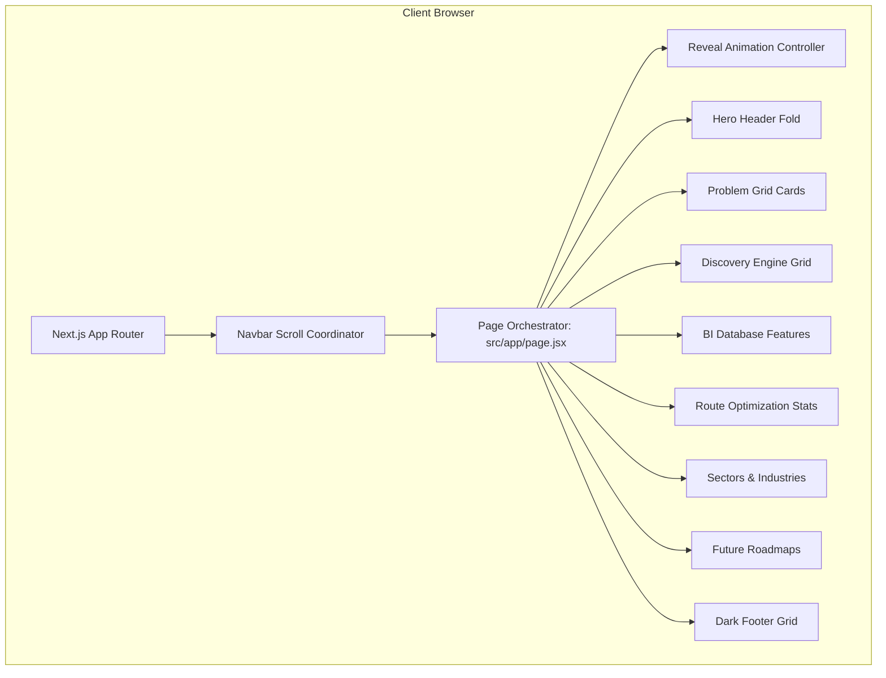
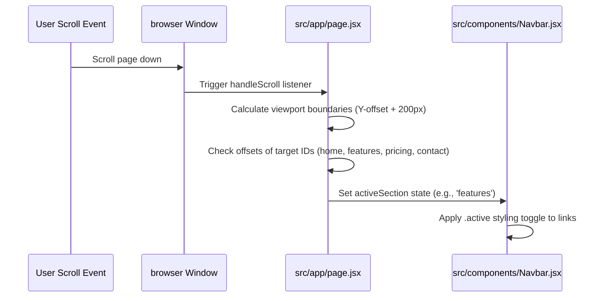

# MapWork — Master Project Documentation

This consolidated document provides a complete, single-source-of-truth overview of the MapWork platform for project submission. It outlines the current product vision, tech stack, codebase folder structure, architecture layout, system designs, coding guidelines, and future enterprise scale roadmaps.

---

## Table of Contents
1. [Project Overview & Business Vision](#1-project-overview--business-vision)
2. [System Architecture](#2-system-architecture)
3. [Folder Structure & Core Configs](#3-folder-structure--core-configs)
4. [Technology Stack](#4-technology-stack)
5. [Local Development Setup](#5-local-development-setup)
6. [Frontend & Styling Specifications](#6-frontend--styling-specifications)
7. [Future System Architecture Roadmaps](#7-future-system-architecture-roadmaps)
8. [Code Style & Contribution Guidelines](#8-code-style--contribution-guidelines)
9. [Decision & Change Logs](#9-decision--change-logs)
10. [Troubleshooting Guide](#10-troubleshooting-guide)
11. [Glossary of Terms](#11-glossary-of-terms)

---

## 1. Project Overview & Business Vision

### Mission Statement
MapWork is a next-generation **geo-intelligence and territory management platform** built to optimize professional field operations. 

In field sales, distributions, collections, and physical audits, organizations leak efficiency due to unstructured transit, duplicate travels, and stale location coordinates. MapWork divides geographic regions into micro-zones and monitors local business pin placements, compiling structured databases and auto-generating optimized pathways to save up to 30% in fuel and transit times.

### User Personas
*   **Territory Sales Director**: Outlines regional boundaries, structures rep coverage areas, and audits team performance metrics.
*   **Field Sales Executive**: Travels physically to complete onsite pitches, audits local inventories, and relies on fast A-to-B navigation coordinates.

### Value Proposition Matrix
| Operational Element | Consumer Navigation Tools (e.g. Google Maps) | Traditional Sales CRM (e.g. HubSpot) | MapWork Platform |
| :--- | :--- | :--- | :--- |
| **Grid Partitioning**| No | No | **Yes** (Micro-Zones) |
| **Path Optimization**| Simple A-to-B routing | No | **Yes** (Multi-stop coordinates) |
| **B2B Local Scan**   | Manual search | No | **Yes** (Automated scanning) |
| **Data Export**      | No | Native | **Yes** (API standard exports) |

---

## 2. System Architecture

MapWork is architected as an optimized, statically compiled client-side landing web portal leveraging Next.js 15 App Router conventions.

### Page Orchestration Flow


### Scroll highlighting data-flow


---

## 3. Folder Structure & Core Configs

Below is the directory map of the MapWork repository:

```text
mapwork/
├── docs/                     # Technical documentation system (30 files)
├── public/                   # Public assets (icons, favicon.svg)
├── src/                      # Project source
│   ├── app/                  # Next.js App Router components & entry layout
│   │   ├── globals.css       # Core stylesheets and style variables
│   │   ├── layout.jsx        # Root HTML node shell and SEO metadata cards
│   │   └── page.jsx          # Home orchestrator page & scroll observer loops
│   ├── assets/               # Local images loaded dynamically in views
│   │   ├── discovery.png     # Scan engine mockup image
│   │   ├── hero.png          # Dashboard mockup image
│   │   └── route_planning.png# Route optimizer image
│   └── components/           # Modular section components
│       ├── Database.jsx      # Database feature list layout
│       ├── DiscoveryEngine.jsx# Grid scanning panel tabs
│       ├── Footer.jsx        # Brightness-optimized dark footer links
│       ├── Hero.jsx          # Launch CTA button links
│       ├── Industries.jsx    # Sector categories details
│       ├── Navbar.jsx        # Sticky navigation overlay mobile drawer
│       ├── Problem.jsx       # Problem cards wrapper
│       ├── Roadmap.jsx       # Phase checklist card component
│       └── RoutePlanning.jsx # Statistics grid layout
├── next.config.js            # Build output tracing and ESLint ignore adjustments
├── package.json              # Compile port configurations (Port 3080)
└── README.md                 # Documentation system root landing page
```

---

## 4. Technology Stack

*   **Next.js (v15.1.6)**: Core framework providing App Router, layout caching, sitemap optimization, and static compilation triggers.
*   **React (v19.2.7) & React-DOM**: Interface state rendering engine.
*   **Vanilla CSS with CSS Custom Variables**: Custom styling parameters declared inside `globals.css` ensuring sub-millisecond loader parsing speeds without compilation overhead.
*   **Oxlint (v1.71.0)**: A high-performance codebase checker that audits script violations in milliseconds.

---

## 5. Local Development Setup

### ⚙️ Prerequisites
Ensure **Node.js (v18.x or above)** and **npm** are installed.

### 🚀 Commands Cheat Sheet
*   **Install Packages**:
    ```bash
    npm install
    ```
*   **Run Local Development Server** (Runs on port **3080**):
    ```bash
    npm run dev
    ```
*   **Clean and Build Standalone Production Assets** (Clears cache and forces compilation):
    ```powershell
    Remove-Item -Recurse -Force .next
    npm run build
    ```
*   **Launch Production Server** (Starts Next.js instance on port **3080**):
    ```bash
    npm start
    ```
*   **Trigger Code Style Audit** (Oxlint validation):
    ```bash
    npx oxlint
    ```

---

## 6. Frontend & Styling Specifications

### CSS custom tokens
Located inside `src/app/globals.css`, these variables control layout boundaries, colors, and elevations:
*   `--color-primary-navy`: `#0B1F45` (core brand color)
*   `--color-accent-red`: `#C81E3A` or `#ef233c` (CTA highlights)
*   `--font-heading`: `'Outfit'`, `'Inter'`, sans-serif (headers)
*   `--font-body`: `'Inter'`, sans-serif (body text)
*   `--transition-normal`: `0.3s cubic-bezier(0.4, 0, 0.2, 1)`

### Scroll Reveal Controllers
As the user scrolls down, an observer detects DOM classes containing `.reveal` and appends `.active` to make elements fade in dynamically:
```css
.reveal {
  opacity: 0;
  transform: translateY(20px);
  transition: opacity 0.6s ease-out, transform 0.6s ease-out;
}
.reveal.active {
  opacity: 1;
  transform: translateY(0);
}
```

---

## 7. Future System Architecture Roadmaps

MapWork's landing page is currently a frontend-only static interface. As the platform transitions to a dynamic web application, we recommend the following target architectures:

### A. PostgreSQL Database Schema
For persistence, we propose mapping databases via Prisma ORM to PostgreSQL:

```mermaid
erDiagram
    USERS ||--o{ TERRITORIES : owns
    USERS {
        uuid id PK
        string email
        string password_hash
        timestamp created_at
    }
    TERRITORIES ||--o{ ACCUMULATED_LEADS : contains
    TERRITORIES {
        uuid id PK
        uuid user_id FK
        string region_name
        polygon boundary_coordinates
    }
    ACCUMULATED_LEADS {
        uuid id PK
        uuid territory_id FK
        string business_name
        float latitude
        float longitude
        string place_id UNIQUE
        string category
    }
```

### B. REST API Endpoint Designs
We recommend creating route handlers inside `src/app/api/...` subfolders:
*   `POST /api/contact`: Submits contact queries (with server-side Zod validation and a hidden CSS honeypot spam filter).
*   `POST /api/leads/scan`: Sends geocoding coordinates (latitude, longitude, radius) to retrieve coordinate grids.

### C. Authentication Security
Implement **NextAuth.js (Auth.js)** to protect dashboard paths (e.g. `/dashboard`). Custom sessions are stored in encrypted, same-site, `httpOnly` cookies to protect against token interception via XSS.

---

## 8. Code Style & Contribution Guidelines

### Branch Workflow
All changes must enter via a Pull Request (PR) from a feature branch:
*   Branch naming standard: `feature/description` or `bugfix/description`.
*   Commit naming standard (Conventional Commits): `feat: add about page layouts`, `fix: enforce footer contrast`.

### Styling Guidelines
*   **React Components**: File names must use PascalCase (e.g., `Navbar.jsx`). Put Client components (`"use client"`) only where event listeners or React hooks are required.
*   **CSS Classes**: Enforce kebab-case (`.mobile-drawer-link`).

---

## 9. Decision & Change Logs

### ADR 01: Migration to Next.js App Router
*   *Context*: Vite React SPA ran calculations on client-only bundles, resulting in layout shifts and poor SEO indexing.
*   *Decision*: Migrated to Next.js 15 App Router. 
*   *Consequence*: Solved layout shifts (via SSG pre-rendering) and enabled static SEO meta exports.

### ADR 02: Relocation of CSS Styles to `globals.css`
*   *Context*: Multiple stylesheets created formatting overrides and bloated loaders.
*   *Decision*: Consolidated layout styles into `src/app/globals.css`.

### ADR 03: Compilation Output Tracing overrides
*   *Context*: Windows file locks and permission limits threw compiler crashes (`errno -4071`) during Next.js audits.
*   *Decision*: Configured `outputFileTracingRoot: __dirname` inside `next.config.js` to prevent Next.js from checking directories outside the project root.

---

## 10. Troubleshooting Guide

### Port is Busy error (`EADDRINUSE`)
If port `3080` is in use, terminate active node processes:
*   **Windows (PowerShell)**:
    ```powershell
    Get-NetTCPConnection -LocalPort 3080 | Select-Object -ExpandProperty OwningProcess | ForEach-Object { Stop-Process -Id $_ -Force }
    ```
*   **Mac/Linux**:
    ```bash
    kill -9 $(lsof -t -i:3080)
    ```

### Stale compiler locks or missing build artifacts
Clear cache directories and run standard Next.js compilation:
```powershell
Remove-Item -Recurse -Force .next
npm run build
```

---

## 11. Glossary of Terms

*   **Geo-Intelligence**: Integrating geographic data (such as GPS coordinates) with business data to optimize operations.
*   **Micro-Zone**: A sub-kilometer grid used for partitioning cities and tracking territory coverage.
*   **Place ID**: A unique string identifier assigned to a coordinate location point by mapping APIs.
*   **Hydration**: The process of linking client-side JavaScript behaviors and events to pre-rendered server HTML.
*   **Oxlint**: An ultra-fast, Rust-based linter that scans codebase syntax without the slow execution times of older libraries.
