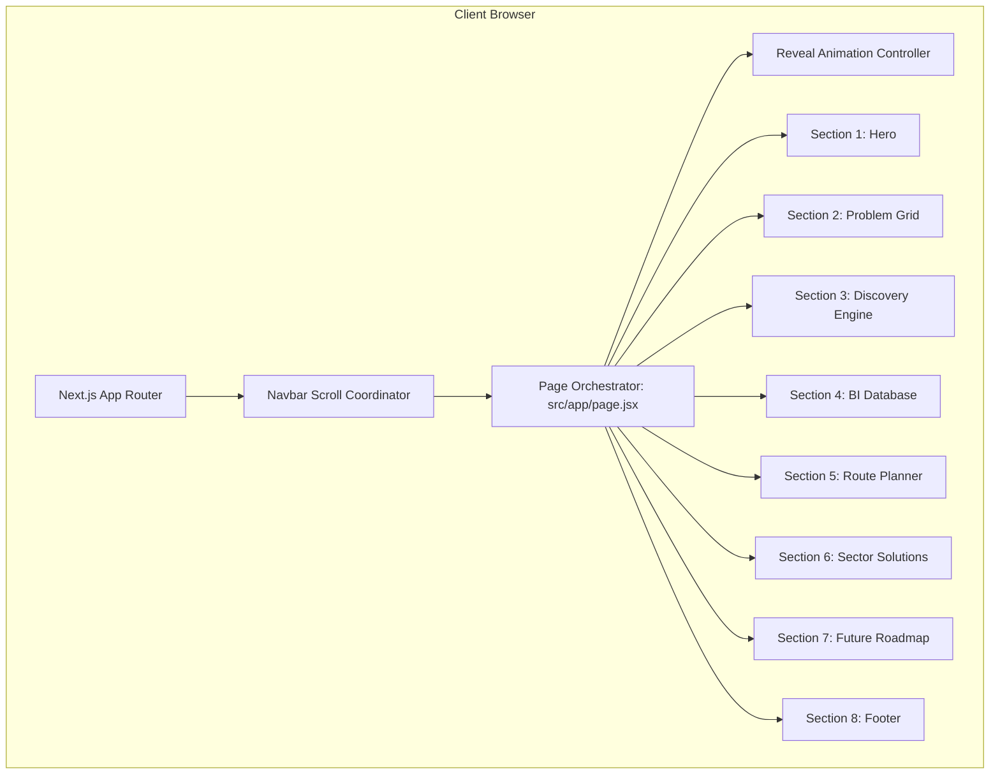
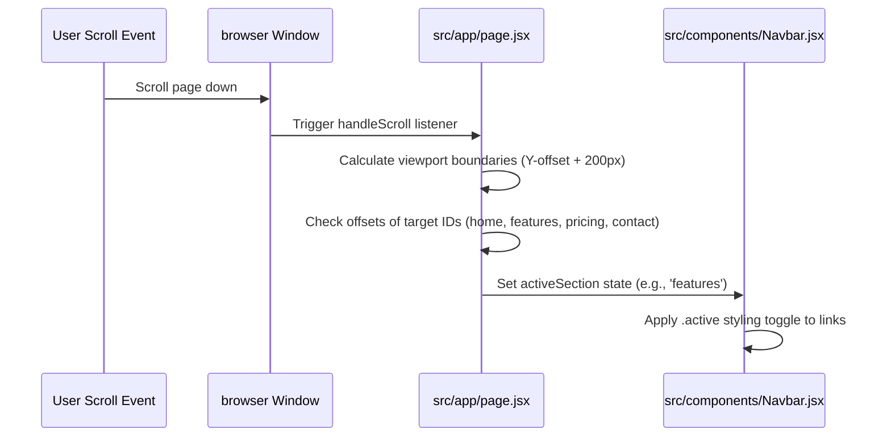

# System Architecture

MapWork is architected as an optimized, responsive front-end landing platform utilizing the Next.js 15 App Router architecture.

---

## 🏗️ Overall Architecture

The application is structured as a single-page orchestrator with modular UI viewports:

---

## 🔄 Rendering Strategy
MapWork utilizes **Static Site Generation (SSG)** to ensure maximum page performance and instant rendering:
*   **Static Layouts**: The document structure is pre-rendered at compile time by Next.js.
*   **Hybrid Hydration**: The UI loads as a static HTML page, then hydrates the interactive JavaScript components (`"use client"`) like observers, mobile drawers, and link-tracking scroll events.
*   **Performance Benefits**: Time to Interactive (TTI) is optimized, and layout shifts (CLS) are minimized because CSS styles are injected server-side.

---

## 📦 Component Communication & Data Flow

### Scroll Synchronization Workflow
When the browser initiates a scroll event, the state and layout components coordinate to identify the active section coordinates:

---

## 🛠️ Build & Compilation Flow
The build is compiled into static chunks for cloud deployments:
1.  **Linter Audit**: Runs linter check (`npx oxlint`) to evaluate syntax correctness.
2.  **Compilation (`next build`)**: Next.js parses the code and creates optimized HTML/CSS static files.
3.  **Trace Analysis**: Uses `outputFileTracingRoot` configuration inside `next.config.js` to trace and bundle dependencies into the `.next/` standalone output environment.
