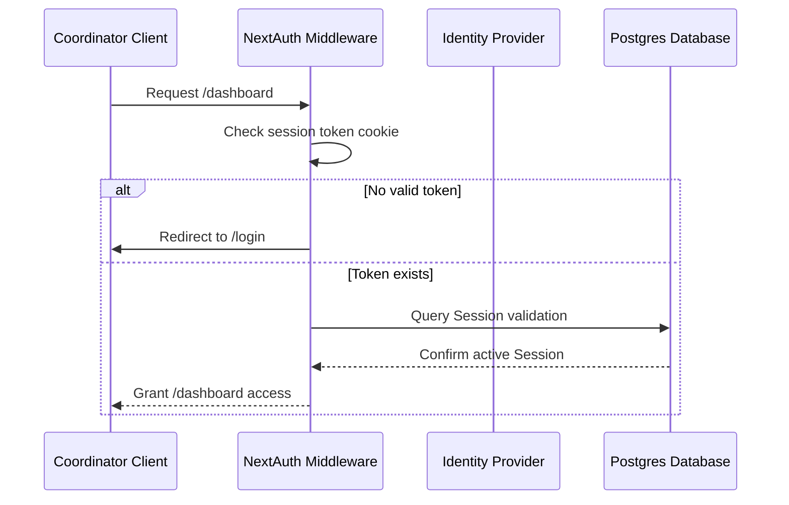

# Authentication Strategy

This document outlines the authentication strategy recommended for MapWork.

---

## 📋 Current Implementation Status
The website is currently public and static. **No authentication libraries, access logs, or protected views are implemented**.

All sections (including features list and industries sheets) serve publicly to all users.

---

## 🔮 Recommended Future Authentication Architecture
To support dashboard access for territory coordinators and sales managers, we recommend integrating **NextAuth.js (Auth.js)** into the App Router platform.

---

## 🔐 Future Security Specifications
1.  **JWT Session Tokens**: Store user claims in encrypted, `httpOnly`, same-site session cookies to prevent Cross-Site Scripting (XSS) token interception.
2.  **Multiclass Authorization**: Add roles (`Director`, `Coordinator`, `Agent`) to the session structure and evaluate permissions inside file-system middleware.
3.  **Third-Party Authentication (OAuth)**: Provide passwordless logins by integrating Google, Microsoft, or HubSpot OAuth providers.
