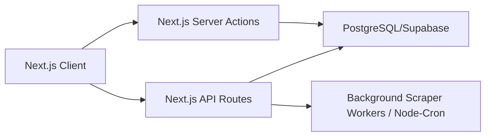

# Backend Architecture

This document describes the backend systems structure and recommendations for MapWork.

---

## 📋 Current Backend Status
The MapWork application is a **frontend-only, statically compiled Next.js application**. 

No external Web/API servers, microservices, databases, or cloud task workers exist.

---

## 🔮 Recommended Future Backend Architecture
As MapWork transitions into a dynamic web app, we recommend a hybrid architecture utilizing Next.js built-in features and external workers:

### 1. Server Actions (For User Forms and UI State Changes)
Write server actions directly inside `src/app/actions.js` labeled `"use server";`. Next.js processes these triggers as hidden POST endpoints, removing the boilerplate of building standard REST controllers:
*   Use Case: Account signup, territory saves, password changes.

### 2. API Routes (For Third-Party Hook Integrations)
Create route handlers (`route.js`) inside nested folders in `/api/`.
*   Use Case: Receiving incoming webhooks (e.g. Payment notices, CRM updates).

### 3. Background Scraper Workers (For Geo-Scraping Services)
Since geographic discovery tasks are resource-heavy and can exceed standard serverless timeout limits (e.g., 10-second limits on Vercel Hobby accounts), we recommend offloading city-wide scans:
*   Deploy a lightweight Node.js/Go background worker on AWS EC2 or Render.
*   The worker processes tasks using a queue system (like BullMQ or RabbitMQ) and writes outputs back to the Postgres Database.
