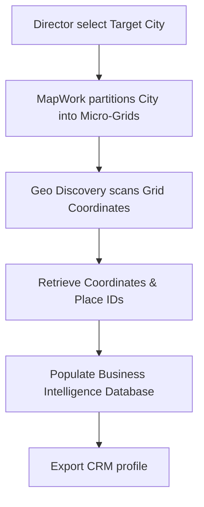

# Project Overview

## 🎯 Product Vision & Mission
MapWork is a next-generation **geo-intelligence and territory management platform** designed to optimize professional field operations. 

In modern field sales, collections, physical auditing, and logistics, organizations suffer massive inefficiencies. Agents travel along unoptimized routes, lack exact coordinate mapping, and rely on stale business databases. MapWork's mission is to provide:
*   **Zero-Waste Operations**: Structuring routes to maximize visits and reduce transport costs by up to 30%.
*   **Real-Time Lead Discovery**: Scraping and updating local establishment lists.
*   **Geographic Micro-Zoning**: Breaking down cities into digestible grids for team allocation.

---

## 👥 Target Audience & User Personas

### 1. The Territory Sales Director
*   **Responsibility**: Defines regional boundaries, sets sales targets, and structures executive routes.
*   **Pain Points**: Lack of visibility into physical team locations; overlapping sales routes resulting in wasted fuel and time.
*   **MapWork Benefit**: Can allocate specific sectors to team members and monitor performance via micro-zone overlays.

### 2. The Field Sales Executive
*   **Responsibility**: Travels physically to verify leads, complete onsite audits, or pitch services.
*   **Pain Points**: Spent hours on navigation; incomplete business contact lists.
*   **MapWork Benefit**: Learns the most optimized route to visit coordinates and accesses structured business details on-the-go.

---

## 🛠️ Core Workflows

### 1. Geographic Scanning & Lead Capture

### 2. Smart Routing Plan
1.  **Selection**: Select target businesses discovered from the database.
2.  **Synthesis**: Core routing algorithm analyzes coordinates.
3.  **Output**: Auto-calculates short-distance paths between coordinates.
4.  **Action**: App routes coordinates directly to field teams, avoiding backtracking.

---

## 📊 Competitive Positioning
Traditional navigation apps (like Google Maps) are built for generic consumer traversal. Enterprise CRM tools (such as Salesforce) excel at relationship data but lack real-time geographical path calculation. MapWork sits in the intersection:

| Feature | Consumer Maps (Google Maps) | Standard CRMs (HubSpot) | MapWork |
| :--- | :--- | :--- | :--- |
| **Grid partitions** | No | No | **Yes** (Micro-Zones) |
| **Route optimization** | Simple A-to-B | No | **Yes** (Multi-stop) |
| **B2B Local scraping** | Manual | No | **Yes** (Auto-scan) |
| **CRM exporting** | No | Native | **Yes** (API Ready) |
