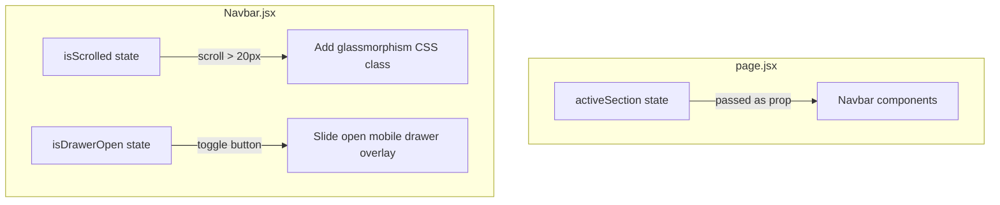

# State Management

This document details state management, events flow, and observation models inside the MapWork client platform.

---

## ⚙️ Local Client-State System

MapWork operates as an optimized frontend application. It manages local UI states natively using React hooks (`useState`), avoiding the extra bundle sizes of heavier state libraries (such as Redux or Zustand).

The following primary states coordinate components:



---

## 👁️ Viewport Interaction Obsession (IntersectionObserver)
To synchronize links with the active section the user is reading:
1.  A window scroll listener evaluates the scroll coordinates:
    ```javascript
    const handleScroll = () => {
      const scrollPosition = window.scrollY + 200; // 200px offset for early highlight trigger
      // Evaluates offsets of home, features, pricing, contact
    };
    ```
2.  An `IntersectionObserver` detects when elements with the `.reveal` class enter the viewport, appending `.active` to play scroll entry reveal animations.

---

## 🚀 Recommended Future Architecture
As complexity builds (like search logs, shopping carts, or dashboard states):
*   **Global Context**: Use standard React Context provider structures (`src/context/`) to scale authentication states.
*   **SWR / React Query**: Recommended for caching API queries (such as blog directories or location parameters) to avoid redundant network loading.
