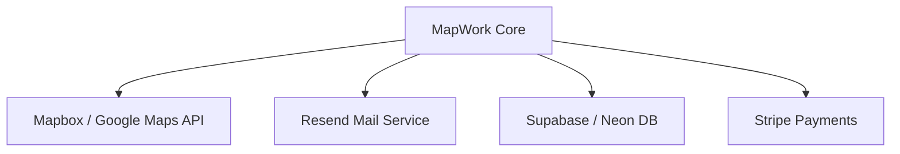

# Third-Party Services

This document lists the third-party integrations and dependencies used by MapWork.

---

## 📋 Active Integrations

### 1. Next.js Fonts Service (Google Fonts API)
MapWork loads Google Fonts (`Outfit` and `Inter`) directly through Next.js core font loader settings in `layout.jsx`:
*   *Purpose*: Consistent font styling.
*   *Alternatives*: Self-hosting font files in `/public/fonts`.

---

## 🔮 Recommended Future Integrations

As the application moves to a production web app, we recommend using these standard integrations:

### 1. Mapbox GL JS / Google Maps API (For Interactive Scans)
*   *Purpose*: Replace static preview mockups with dynamic maps, allowing users to draw boundaries and see pinpoint database results.
*   *Alternatives*: OpenStreetMap (Leaflet).

### 2. Resend (For Email Notifications)
*   *Purpose*: Send contact forms notifications and registration confirmations via API.
*   *Alternatives*: SendGrid, AWS SES.

### 3. Stripe (For Sales & Payments)
*   *Purpose*: Customer checkouts and subscription billing logic.
